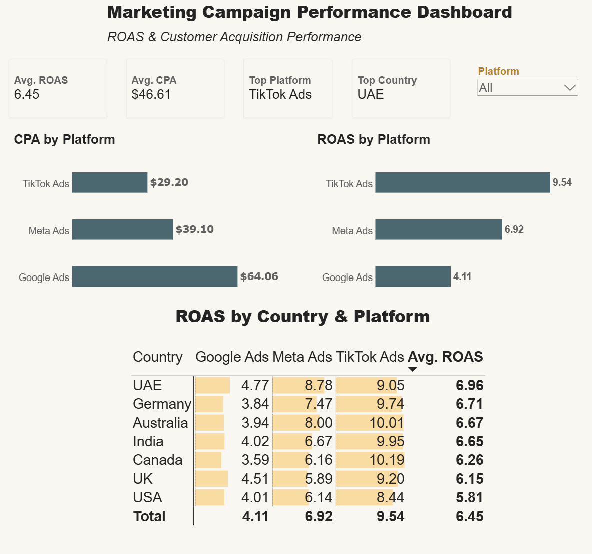
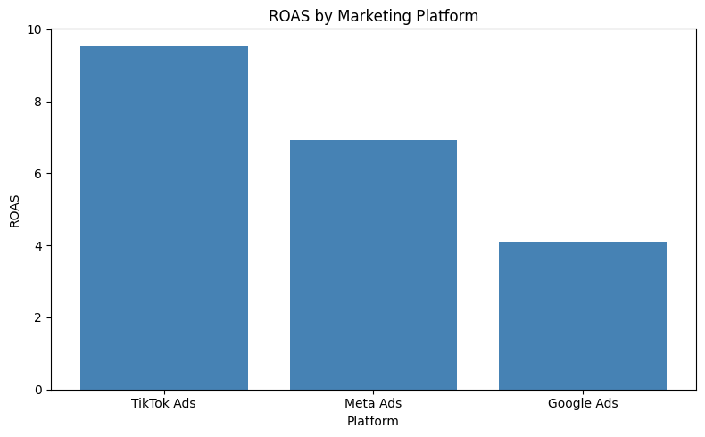

# Marketing Campaign ROAS & Attribution Analysis

## Objective
Analyzed multi-platform digital advertising performance to identify the most cost-efficient and highest-return marketing channel, across platforms, countries, and campaign types.

## Dataset
Global Ads Performance Dataset (Kaggle) — 1,800 campaign records across Google Ads, Meta Ads, and TikTok Ads, spanning 7 countries and multiple industries.

## Tools
Python (Pandas, Matplotlib), SQL (SQLite — CTEs, window functions), Power BI

## Key Findings
- **TikTok Ads** delivered the highest ROAS (9.54) and lowest CPA ($29.20) — outperforming both Meta Ads and Google Ads on cost and return
- TikTok Ads had the **highest ROAS in every one of the 7 countries analyzed**, confirming the finding holds consistently across markets
- Within TikTok, **Search campaigns** performed best (10.52 ROAS), refining the recommendation to a specific platform + format combination
- **UAE** was the top-performing country overall (6.96 average ROAS)
- Recommendation: reallocate ad budget toward TikTok Ads (particularly Search campaigns), prioritizing UAE and similarly high-performing markets

## Approach
1. Loaded and explored the dataset in Python (Pandas)
2. Calculated platform-level KPIs: CTR, CPC, CPA, ROAS
3. Loaded data into SQLite and used SQL (CTEs, window functions) to rank platforms by performance
4. Extended analysis across country, campaign type, and industry dimensions
5. Visualized findings using Matplotlib and built an interactive Power BI dashboard with KPI cards, platform comparison charts, and a country × platform performance matrix

## Dashboard

## Visualization (Python)

